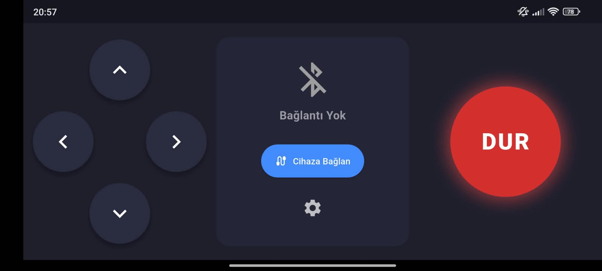

<div align="center">

  <h1>🚗 Arduino Bluetooth Controller</h1>
  <p><strong>Güvenli, Reklamsız ve Tamamen Özelleştirilebilir Arduino Robot Kontrol Uygulaması</strong></p>

  <!-- Teknoloji Rozetleri -->
  <p>
    
    
    
    
    
  </p>

  <br />

  <!-- APK İndirme Butonu -->
 <!-- APK İndirme Butonu -->
  <a href="https://github.com/miracbozacioglu/arduino-bluetooth-controller/releases/download/v1.0.0/arduino_controller.apk">
    
  </a>
  <p><em>(Yukarıdaki butona tıklayarak derlenmiş hazır APK'yı doğrudan telefonunuza indirebilirsiniz.)</em></p>

  <br />

  <!-- Uygulama Ekran Görüntüsü -->
  <p align="center">
    
  </p>

</div>

<hr />

## 🌟 Neden Bu Uygulama?

* 🚫 **Sıfır Reklam:** Mağazadaki hazır kumanda uygulamalarının aksine tam ekran video veya banner reklamlar içermez.
* 🔒 **Gizlilik Odaklı:** İnternet erişim izni gerektirmez, kişisel verilerinizi toplamaz ve üçüncü taraf sunuculara göndermez.
* 🕹️ **Yatay Ergonomik Tasarım:** İki elle rahat kontrol için özel olarak konumlandırılmış yön tuşları ve acil durum fren butonu.
* ⚙️ **Dinamik Karakter Haritalama:** Arduino kodunuzdaki karakterlerle eşleşmesi için `F`, `B`, `L`, `R`, `S` harflerini arayüz üzerinden dinamik olarak değiştirebilme.

---

## 🎮 Arayüz Yerleşimi ve Komut Şeması

Uygulama yatay ekranda 3 temel bölgeden oluşur:

| Bölge | Fonksiyon | Gönderilen Varsayılan Karakter |
| :--- | :--- | :---: |
| **Sol Panel** | İleri Yön Tuşu | `F` |
| **Sol Panel** | Geri Yön Tuşu | `B` |
| **Sol Panel** | Sol Dönüş Tuşu | `L` |
| **Sol Panel** | Sağ Dönüş Tuşu | `R` |
| **Orta Panel** | Bluetooth Bağlantı & Dinamik Ayarlar | - |
| **Sağ Panel** | Acil Durdurma Butonu | `S` |

---

## 🛠️ Arduino Tarafı Entegrasyonu (Örnek Alıcı Kodu)

HC-05 veya HC-06 modülünüzü Arduino'ya bağladıktan sonra aşağıdaki örnek kod ile komutları okuyabilirsiniz:

```cpp
#include <SoftwareSerial.h>

// HC-05 TX -> Arduino Pin 10 (RX)
// HC-05 RX -> Arduino Pin 11 (TX)
SoftwareSerial BTSerial(10, 11);

void setup() {
  Serial.begin(9600);
  BTSerial.begin(9600);
  Serial.println("Arduino Bluetooth Alıcı Hazır!");
}

void loop() {
  if (BTSerial.available()) {
    char command = BTSerial.read();
    Serial.print("Gelen Komut: ");
    Serial.println(command);

    switch (command) {
      case 'F':
        // Motorları İleri Sür
        break;
      case 'B':
        // Motorları Geri Sür
        break;
      case 'L':
        // Sola Dön
        break;
      case 'R':
        // Sağa Dön
        break;
      case 'S':
        // Motorları Durdur
        break;
      default:
        break;
    }
  }
}
---

<div align="center">

  ## ⭐ Projeyi Beğendiniz mi?
  
  Eğer bu proje işinize yaradıysa veya beğendiyseniz, repoyu kaydetmek ve destek olmak için **sağ üst köşeden bir Yıldız (Star) bırakmayı unutmayın!** 🌟

  
</div>